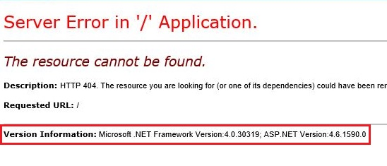

# Fingerprint Web Application Framework

#### HTTP headers

_**Request:**_

```bash
┌──(web㉿unk9vvn)-[~]
└─$ $ nc $WEBSITE 80
HEAD / HTTP/1.1
```

_**Response:**_

```http
HTTP/1.1 200 OK
Server: Apache/2.2 (Ubuntu 12.04)
[...]
X-Powered-By: PHP/5.3.3
```

`X-Generator` Header identifies that this site is being built with Drupal.

_**Request:**_

```bash
┌──(web㉿unk9vvn)-[~]
└─$ $ nc $WEBSITE 80
HEAD / HTTP/1.1
```

_**Response:**_

```http
HTTP/1.1 200 OK
Server: nginx/1.4.1
[...]
X-Generator: Drupal 7
```

**http\_header module in Metasploit**

```bash
┌──(unk9vvn㉿WebApp)-[~]
└─$ sudo msfconsole -qx "use scanner/http/http_header;set RHOSTS $WEBSITE;set THREADS 10;run;exit"
```

```xml
<system.webServer>
  <httpProtocol>
    <customHeaders> 
      <remove name="X-Powered-By" />
    </customHeaders> 
  </httpProtocol>
</system.webServer>
```

#### Cookies

_**Request:**_

```http
GET /cake HTTP/1.1
User-Agent: Mozilla/5.0 (compatible; MSIE5.01; Windows NT)
Host: www.example.com
Accept-Language: en-us
Accept-Encoding: gzip, deflate
Cookie: CAKEPHP=mn23gmaumjdekprivsbuqi86;
Connection: Keep-Alive
```

_**Response:**_

```php
/
* The name of CakePHP's session cookie.
*
* Note the guidelines for Session names states: "The session name references
* the session id in cookies and URLs. It should contain only alphanumeric
* characters."
* @link http://php.net/session_name
*/
Configure::write('Session.cookie', 'CAKEPHP');
```

#### HTML Source Code

```javascript
<script type="text/javascript" src="/zkau/web/bb9dff2f/js/zk.wpd" charset="UTF-8"></script>
<script type="text/javascript" src="/zkau/web/bb9dff2f/js/zul..lang.wpd" charset="UTF-8"></script>
<script type="text/javascript" src="/zkau/web/bb9dff2f/js/zuljsp.js” charset="UTF-8"></script>
<!-- ZK 6.5.1.1 EE 2012121311 -->
<script class="z-runonce" type="text/javascript">//<! [CDATA[
zkopt({to:660}) ;//]]>
</script><script type="text/javascript">
zUtl.progressbox = function(id, msg, mask, icon, _opts) {
if (mask && zk.Page. contained. length) {
....
```

**Automatic Dir busting Tools**

**Burp Suite**

`BurpSuite -> Proxy -> Right Click on One Domain -> Send to Intruder -> Intruder`

**DirB**

```bash
┌──(web㉿unk9vvn)-[~] 
└─$ sudo dirb $WEBSITE/ -f 
```

**DirSearch**

```bash
┌──(web㉿unk9vvn)-[~] 
└─$ sudo dirsearch -u $WEBSITE -w /usr/share/seclists/Discovery/Web-Content/raft-medium-directories-lowercase.txt -e php,txt,cnf,conf
```

**WFuzz**

```bash
┌──(web㉿unk9vvn)-[~] 
└─$ sudo wfuzz -c -Z -z file,/usr/share/seclists/Discovery/Web-Content/raft-medium-directories-lowercase.txt --sc 200 "$WEBSITE/FUZZ"
```

**GoBuster**

```bash
┌──(web㉿unk9vvn)-[~] 
└─$ sudo gobuster dir -w /usr/share/seclists/Discovery/Web-Content/raft-medium-directories-lowercase.txt -u $WEBSITE -x php,txt,cnf,conf
```

#### File Extensions

* `.php` – PHP
* `.aspx` – Microsoft ASP.NET
* `.jsp` – Java Server Pages

#### Error Messages

<figure><figcaption></figcaption></figure>

#### Automatic Fingerprinting Tools

**WhatWeb**

```bash
┌──(web㉿unk9vvn)-[~]
└─$ sudo whatweb $WEBSITE
```

**Nikto**

```bash
┌──(web㉿unk9vvn)-[~]
└─$ sudo nikto -url $WEBSITE -evasion 1
```


